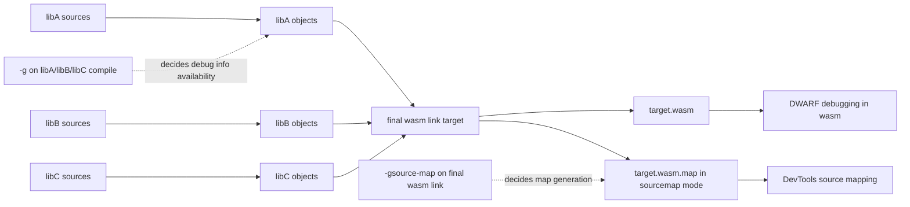
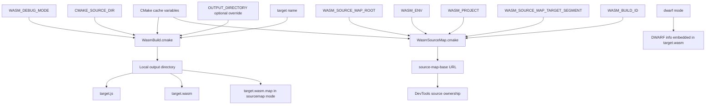

# CMake Wasm Helper Modules Developer Guide

这份文档面向维护 `demos/05-cmake-emcmake/cmake/WasmBuild.cmake` 与 `demos/05-cmake-emcmake/cmake/WasmSourceMap.cmake` 的开发者，重点说明这两个模块的职责边界、接入方式、参数约定与常见使用模式。

## 1. 模块职责

这两个模块是分层设计的。

1. `WasmBuild.cmake`
   - 负责 `WASM_DEBUG_MODE` 对应的编译参数与链接参数。
   - 负责把编译参数应用到指定 target。
   - 负责给最终 Wasm target 设置输出目录、输出后缀、导出函数、导出运行时方法。
   - 负责在需要时调用 sourcemap 模块。

2. `WasmSourceMap.cmake`
   - 负责把 `WASM_SOURCE_MAP_ROOT`、`WASM_ENV`、`WASM_PROJECT`、`WASM_BUILD_ID`、`target_segment` 组合成统一的 `--source-map-base`。
   - 负责只在 `sourcemap` 模式下给最终 target 注入 `-gsource-map` 与 `--source-map-base=...`。

可以把它们理解为：

1. `WasmBuild.cmake` 决定“怎么构建 Wasm target”。
2. `WasmSourceMap.cmake` 决定“sourcemap URL 应该长什么样”。

## 2. 为什么拆成两个模块

拆分的核心目的是把“构建参数问题”和“部署 URL 规则问题”分开。

1. `-O2 / -O0 -g / -O1 -g` 属于编译与链接策略。
2. `--source-map-base` 属于浏览器如何理解 sourcemap 资源 URL 的策略。
3. 二者虽然都在 Wasm 调试链路里，但不是同一类问题。

这样拆分后有几个好处：

1. `WasmBuild.cmake` 可以在别的项目里单独复用，即使对方不需要统一 sourcemap URL。
2. `WasmSourceMap.cmake` 可以独立演进 URL 模板，而不影响编译参数逻辑。
3. 出现调试问题时，更容易判断故障是在“编译单元没有调试信息”还是“浏览器 sourcemap URL 归属错误”。

## 3. 接入方式

顶层 `CMakeLists.txt` 的典型接入方式如下：

```cmake
list(APPEND CMAKE_MODULE_PATH "${CMAKE_CURRENT_SOURCE_DIR}/cmake")
include(WasmBuild)

initialize_wasm_build_defaults(
   DEBUG_MODE "sourcemap"
   DEBUG_INFO "auto"
   DEBUG_LEVEL "default"
   SOURCE_MAP "auto"
   SOURCE_MAP_ROOT "http://localhost:8000"
   ENV "demos"
   PROJECT_SEGMENT "05-cmake-emcmake"
   BUILD_ID "sourcemap"
   TARGET_SEGMENT "output"
)

create_wasm_debug_interface(cmake_project_debug_info)

create_wasm_debug_interface(cmake_balanced_debug_info PRESET balanced)

print_wasm_build_summary()
add_subdirectory(src)

configure_wasm_build(
  cmake_demo
   DEBUG_INFO "on"
   DEBUG_LEVEL "2"
  EXPORTED_FUNCTIONS "[\"_run_cmake_demo\"]"
  EXPORTED_RUNTIME_METHODS "[\"ccall\"]"
)
```

子目录 `src/CMakeLists.txt` 中的典型写法如下：

```cmake
add_library(cmake_core STATIC core/accumulator.cc)
target_include_directories(cmake_core PUBLIC ${CMAKE_CURRENT_SOURCE_DIR})

add_library(cmake_domain STATIC domain/simulation.cc)
target_link_libraries(cmake_domain PUBLIC cmake_core)

attach_wasm_debug_interface(
   cmake_project_debug_info
   TARGETS cmake_core cmake_domain
)

add_executable(cmake_demo app/main.cc)
target_link_libraries(cmake_demo PRIVATE cmake_domain)
```

推荐约定是：

1. 静态库 target 用 `apply_wasm_compile_options(target)`。
2. 最终 Wasm 可执行 target 用 `configure_wasm_build(target ...)`。
3. 顶层默认变量用 `initialize_wasm_build_defaults(...)` 初始化，而不是在 `CMakeLists.txt` 中散落多组 `set(... CACHE ...)`。
4. 当库 target 很多时，用 `create_wasm_debug_interface(...)` + `attach_wasm_debug_interface(...)` 批量挂调试编译参数。

## 4. `WasmBuild.cmake` API 说明

### 4.1 `get_wasm_compile_flags(out_var)`

根据 `WASM_DEBUG_MODE` 返回编译参数。

当前规则：

1. `release` -> `-O2`
2. `dwarf` -> `-O0 -g`
3. `sourcemap` -> `-O1 -g`

它现在还支持以下控制项：

1. `DEBUG_INFO`
   - `auto`
   - `on`
   - `off`
2. `DEBUG_LEVEL`
   - `default`
   - `0`
   - `1`
   - `2`
   - `3`
   - `line-tables-only`
3. `EXTRA_FLAGS`
   - 用于按 target 追加额外编译选项

设计原因：

1. `sourcemap` 模式下 map 在链接阶段生成，但对象文件仍然需要调试信息。
2. 如果静态库编译阶段没有 `-g`，最终 `*.wasm.map` 很容易只剩系统库源码而没有业务源码。

### 4.2 `get_wasm_link_flags(out_var)`

根据 `WASM_DEBUG_MODE` 返回链接参数。

当前规则：

1. `release` -> `-O2`
2. `dwarf` -> `-O0 -g`
3. `sourcemap` -> `-O1`

注意：

1. `sourcemap` 模式下，这里故意不直接返回 `-gsource-map`。
2. `-gsource-map` 由 `WasmSourceMap.cmake` 在最终 target 层面注入。
3. `DEBUG_INFO` 为 `off` 时，这里不会再为非 sourcemap 模式追加 `-g` 相关链接参数。

### 4.3 `apply_wasm_compile_options(target)`

把当前模式对应的编译参数应用到一个已存在的 target。

适用对象：

1. `STATIC` 库
2. `OBJECT` 库
3. 需要参与最终 Wasm 链接且必须保留调试信息的其他 target

支持的可选参数：

1. `DEBUG_INFO`
2. `DEBUG_LEVEL`
3. `EXTRA_FLAGS`

示例：

```cmake
apply_wasm_compile_options(cmake_core DEBUG_INFO on DEBUG_LEVEL 1)
apply_wasm_compile_options(cmake_domain DEBUG_INFO off)
apply_wasm_compile_options(cmake_platform EXTRA_FLAGS -fno-inline)
```

不建议把它当作“全局目录级配置”的替代品。这个函数的目的就是显式、精准地控制 target。

### 4.4 `create_wasm_debug_interface(interface_target ...)`

这个函数会创建一个 `INTERFACE` 配置 target，用于把调试相关编译参数批量挂到很多库上。

支持的参数：

1. `DEBUG_INFO`
2. `DEBUG_LEVEL`
3. `EXTRA_FLAGS`
4. `APPLY_LINK_OPTIONS`
5. `PRESET`

支持的预设：

1. `custom`
2. `minimal`
3. `balanced`
4. `full`
5. `disabled`

默认行为：

1. 默认只挂编译参数。
2. 如果显式传 `APPLY_LINK_OPTIONS`，也会把对应链接参数挂到这个 `INTERFACE` target 上。
3. 如果传了 `PRESET`，会先应用预设，再允许 `DEBUG_INFO` / `DEBUG_LEVEL` 显式覆盖。

最常见的用法是把它作为“很多静态库共享的一组调试编译选项”。

### 4.5 `attach_wasm_debug_interface(interface_target ...)`

这个函数用于把一个已有的 `INTERFACE` 调试 target 批量挂到多个目标上。

支持的参数：

1. `TARGETS`
2. `VISIBILITY`

示例：

```cmake
create_wasm_debug_interface(cmake_project_debug_info DEBUG_INFO auto DEBUG_LEVEL 2)
create_wasm_debug_interface(cmake_full_debug_info PRESET full)

attach_wasm_debug_interface(
   cmake_project_debug_info
   TARGETS cmake_core cmake_platform cmake_domain
)
```

### 4.6 `configure_wasm_build(target ...)`

这是最终 Wasm target 的统一入口。

支持的参数如下：

1. `OUTPUT_DIRECTORY`
   - 最终产物输出目录。
   - 会映射到 `RUNTIME_OUTPUT_DIRECTORY`。
   - 如果不传，默认使用 `${CMAKE_SOURCE_DIR}/output/${WASM_DEBUG_MODE}`。

2. `TARGET_SUFFIX`
   - 最终产物后缀。
   - 默认是 `.js`。
   - 目前这个 demo 没有覆盖它，但保留了扩展点。

3. `SOURCE_MAP_TARGET_SEGMENT`
   - sourcemap URL 中的 target 路径段。
   - 会传给 `configure_wasm_sourcemap(...)`。
   - 如果不传，默认使用全局 `WASM_SOURCE_MAP_TARGET_SEGMENT`。

4. `EXPORTED_FUNCTIONS`
   - 透传为 `-sEXPORTED_FUNCTIONS=...`。
   - 需要使用 Emscripten 的 JSON 数组字符串格式，例如 `["_run_cmake_demo"]`。

5. `EXPORTED_RUNTIME_METHODS`
   - 透传为 `-sEXPORTED_RUNTIME_METHODS=...`。
   - 例如 `["ccall"]`。

6. `DEBUG_INFO`
   - 覆盖当前 target 的调试信息开关。
   - 可选：`auto`、`on`、`off`。

7. `DEBUG_LEVEL`
   - 覆盖当前 target 的调试信息级别。
   - 可选：`default`、`0`、`1`、`2`、`3`、`line-tables-only`。

8. `EXTRA_COMPILE_FLAGS`
   - 为当前 target 追加额外编译参数。

9. `SOURCE_MAP`
   - 覆盖当前 target 的 sourcemap 开关。
   - 可选：`auto`、`on`、`off`。

它会完成以下事情：

1. 检查 target 是否存在。
2. 设置输出后缀与输出目录。
3. 对最终 target 应用编译参数。
4. 对最终 target 应用链接参数。
5. 按需添加导出函数与 runtime methods。
6. 在 `sourcemap` 模式下调用 `configure_wasm_sourcemap(...)`。
7. 在 configure 阶段打印关键产物位置。

额外控制语义：

1. `DEBUG_INFO=auto`
   - `release` 默认不生成调试信息
   - `dwarf` / `sourcemap` 默认生成调试信息
2. `DEBUG_INFO=on`
   - 强制为当前 target 打开调试信息
3. `DEBUG_INFO=off`
   - 强制为当前 target 关闭调试信息
   - 但这不再自动等于“关闭 sourcemap”，两者已经解耦

4. `SOURCE_MAP=auto`
   - 只有 `WASM_DEBUG_MODE=sourcemap` 时默认开启 sourcemap
5. `SOURCE_MAP=on`
   - 在 `sourcemap` 模式下强制开启 sourcemap
   - 如果当前不是 `sourcemap` 模式，会打印显式 warning，并保持 source map 关闭
6. `SOURCE_MAP=off`
   - 即使当前是 `sourcemap` 模式，也不为这个 target 生成 `.wasm.map`

当前会打印：

1. `WASM_JS_OUTPUT(target)`
2. `WASM_BINARY_OUTPUT(target)`
3. `WASM_SOURCE_MAP_FILE(target)`
4. `WASM_SOURCE_MAP_URL_BASE(target)`

对于使用 `emcmake + cmake` 的工程，这就是“在哪里看编译好的 sourcemap 符号位置”的最快入口：

1. 本地磁盘看 `WASM_SOURCE_MAP_FILE(target)`。
2. 浏览器 URL 归属看 `WASM_SOURCE_MAP_URL_BASE(target)`。

### 4.7 `print_wasm_build_summary()`

在配置阶段打印当前构建摘要，方便快速确认模式是否正确。

推荐在顶层 `CMakeLists.txt` 中尽早调用一次，这样能在 `cmake -S . -B ...` 阶段直接看到：

1. `WASM_DEBUG_MODE`
2. `WASM_DEBUG_INFO`
3. `WASM_DEBUG_INFO_LEVEL`
4. `WASM_SOURCE_MAP`
5. 编译参数
6. 链接参数
7. sourcemap 相关变量

### 4.8 `initialize_wasm_build_defaults(...)`

这个函数用于把原本散落在顶层 `CMakeLists.txt` 里的默认变量初始化收口到模块内部。

支持的参数：

1. `DEBUG_MODE`
2. `DEBUG_INFO`
3. `DEBUG_LEVEL`
4. `SOURCE_MAP`
5. `SOURCE_MAP_ROOT`
6. `ENV`
7. `PROJECT_SEGMENT`
8. `BUILD_ID`
9. `TARGET_SEGMENT`

设计原则是：

1. 提供模块级默认值，降低顶层 `CMakeLists.txt` 对底层变量名的直接依赖。
2. 继续保留 `-DWASM_DEBUG_MODE=...`、`-DWASM_SOURCE_MAP_ROOT=...` 这类外部覆盖能力。
3. 对真实项目来说，顶层通常只需要在这里声明少量项目特有的默认值。
4. 允许把“是否生成调试信息”和“生成到什么级别”作为全局默认值统一配置。
5. 允许把“是否生成 sourcemap”作为独立于调试信息的单独控制线。

## 5. `WasmSourceMap.cmake` API 说明

### 5.1 `wasm_compute_source_map_base(out_var, target_segment)`

这个函数会把以下变量拼接成最终 URL：

1. `WASM_SOURCE_MAP_ROOT`
2. `WASM_ENV`
3. `WASM_PROJECT`
4. `target_segment`
5. `WASM_BUILD_ID`

例如：

1. `WASM_SOURCE_MAP_ROOT=http://localhost:8000`
2. `WASM_ENV=demos`
3. `WASM_PROJECT=05-cmake-emcmake`
4. `target_segment=output`
5. `WASM_BUILD_ID=sourcemap`

生成结果是：

```text
http://localhost:8000/demos/05-cmake-emcmake/output/sourcemap/
```

模块内部会自动去掉多余的前后斜杠，避免出现双斜杠路径。

### 5.2 `configure_wasm_sourcemap(target, target_segment)`

这是 sourcemap 的最终注入函数。

行为如下：

1. 如果当前不是 `sourcemap` 模式，直接返回，不做任何事。
2. 如果 `WASM_SOURCE_MAP_ROOT` 为空，则打印禁用信息并返回。
3. 否则给 target 注入：
   - `-gsource-map`
   - `--source-map-base=<computed-url>`
4. 同时打印 `WASM_SOURCE_MAP_BASE(target)=...` 便于核对。

### 5.3 `initialize_wasm_sourcemap_defaults(...)`

这个函数负责初始化 sourcemap 相关缓存变量，避免调用方手动逐个 `set(... CACHE ...)`。

支持的参数：

1. `SOURCE_MAP_ROOT`
2. `ENV`
3. `PROJECT_SEGMENT`
4. `BUILD_ID`
5. `TARGET_SEGMENT`

如果外部已经通过 `-D...` 传入同名 cache 变量，CMake cache 值仍然会优先生效。

## 6. 变量约定

这两个模块依赖的关键变量如下。

1. `WASM_DEBUG_MODE`
   - 必填。
   - 当前支持：`release`、`dwarf`、`sourcemap`。

2. `WASM_SOURCE_MAP_ROOT`
   - 可选。
   - 为空时表示不启用 `--source-map-base`。

3. `WASM_ENV`
   - 可选。
   - 用于表示环境或顶层业务域，例如 `demos`、`staging`、`prod`。

4. `WASM_PROJECT`
   - 可选。
   - 用于表示项目路径段。

5. `WASM_BUILD_ID`
   - 可选。
   - 用于表示调试模式、版本号或构建编号。

6. `WASM_SOURCE_MAP_TARGET_SEGMENT`
   - 可选。
   - 用于表示产物目录段，例如 `output`。

推荐把这些变量都定义成 `CACHE STRING`，这样：

1. 本地开发可以直接 `-D...` 覆盖。
2. CI/CD 也可以从外部注入。

当前模板已经把这些 `CACHE STRING` 的初始化逻辑封装在模块函数里，顶层只需要提供项目级默认值。

## 7. 推荐使用模式

### 7.1 单个 Wasm target

如果工程里只有一个最终 Wasm target：

1. 所有参与链接的静态库都调用 `apply_wasm_compile_options(...)`。
2. 最终 target 调用一次 `configure_wasm_build(...)`。

### 7.2 多个 Wasm target

如果工程里有多个最终 Wasm target：

1. 所有共享业务库仍然单独调用 `apply_wasm_compile_options(...)`。
2. 每个最终 target 分别调用一次 `configure_wasm_build(...)`。
3. 每个 target 可以共用同一个 `SOURCE_MAP_TARGET_SEGMENT`，也可以按需要覆盖。

### 7.3 CI/CD 构建

推荐从外部注入以下变量：

1. `WASM_DEBUG_MODE`
2. `WASM_SOURCE_MAP_ROOT`
3. `WASM_ENV`
4. `WASM_PROJECT`
5. `WASM_BUILD_ID`

这样可以让同一套模板同时服务：

1. 本地开发调试
2. 测试环境部署
3. 生产构建归档

## 8. 常见误用

### 8.1 只给最终 target 配 `configure_wasm_build(...)`，不给静态库配 `apply_wasm_compile_options(...)`

这是最常见的问题。

结果通常是：

1. `.wasm.map` 文件存在。
2. 浏览器里能看到部分系统库源码。
3. 业务源码不完整，甚至完全不可见。

### 8.2 把 `--source-map-base` 当成“开启调试”的总开关

不是。

1. 是否能看到源码，首先取决于编译单元有没有调试信息。
2. `--source-map-base` 解决的是浏览器如何解析与归属 sourcemap URL。

### 8.3 把 target 级接口退回成目录级全局设置

不建议这么做。

1. 目录级设置在多 target 工程里很容易失控。
2. 精准控制 target 时，不容易看清到底哪些目标带了调试参数。
3. 当前模板已经明确选择“target 级显式应用”的方向。

## 9. 排障建议

当 DevTools 中看不到业务源码时，按下面顺序检查：

1. `WASM_DEBUG_MODE` 是否真的是 `sourcemap`。
2. 静态库 target 是否调用了 `apply_wasm_compile_options(...)`。
3. 最终 target 是否调用了 `configure_wasm_build(...)`。
4. `*.wasm.map` 是否实际生成。
5. `*.wasm.map` 中的 `sources` 字段里是否包含 `src/app`、`src/domain`、`src/core`、`src/platform`。
6. `WASM_SOURCE_MAP_BASE(target)=...` 打印出的 URL 是否与静态服务路径一致。

## 10. 现在可以直接从 CMake 输出里看什么

当前模板已经会在 `configure_wasm_build(...)` 调用期间打印以下信息：

1. `WASM_JS_OUTPUT(target)`：生成的 JS loader 本地路径。
2. `WASM_BINARY_OUTPUT(target)`：生成的 wasm 本地路径。
3. `WASM_SOURCE_MAP_FILE(target)`：生成的 `.wasm.map` 本地路径。
4. `WASM_SOURCE_MAP_URL_BASE(target)`：浏览器解析 sourcemap 时使用的 URL 基准。

因此，如果你想知道“编译好的 sourcemap 符号位置在哪里”，通常看两处就够了：

1. 本地文件位置：`WASM_SOURCE_MAP_FILE(target)`。
2. 浏览器使用的 URL 基准：`WASM_SOURCE_MAP_URL_BASE(target)`。

## 11. sourcemap 与 dwarf 的目录是怎么拼出来的

这部分最容易混淆的点是：

1. 本地生成目录
2. 浏览器看到的 sourcemap URL 归属目录

它们不是同一件事。

### 11.1 先看本地产物目录

在当前模板里，本地产物目录主要由 `WasmBuild.cmake` 中的 `configure_wasm_build(...)` 决定。

规则是：

1. 最终 Wasm target 的输出目录来自 `output_directory`。
2. 如果没有显式传 `OUTPUT_DIRECTORY`，默认使用 `${CMAKE_SOURCE_DIR}/output/${WASM_DEBUG_MODE}`。
3. 然后按 target 名继续拼接文件名：
   - JS: `{output_directory}/{target}.js`
   - Wasm: `{output_directory}/{target}.wasm`
   - Source map: `{output_directory}/{target}.wasm.map`

以本仓库默认值为例：

1. `CMAKE_SOURCE_DIR = demos/05-cmake-emcmake`
2. `WASM_DEBUG_MODE = sourcemap`
3. target = `cmake_demo`

最终本地文件会落到：

1. `output/sourcemap/cmake_demo.js`
2. `output/sourcemap/cmake_demo.wasm`
3. `output/sourcemap/cmake_demo.wasm.map`

### 11.2 再看浏览器 sourcemap URL 基准

浏览器侧的 sourcemap 归属不是由本地磁盘目录决定的，而是由 `WasmSourceMap.cmake` 中的 `wasm_compute_source_map_base(...)` 决定。

当前模板的拼接规则是：

1. `WASM_SOURCE_MAP_ROOT`
2. `WASM_ENV`
3. `WASM_PROJECT`
4. `target_segment`
5. `WASM_BUILD_ID`
6. 最后补一个 `/`

即：

```text
{WASM_SOURCE_MAP_ROOT}/{WASM_ENV}/{WASM_PROJECT}/{target_segment}/{WASM_BUILD_ID}/
```

当前工程默认值下：

1. `WASM_SOURCE_MAP_ROOT = http://localhost:8000`
2. `WASM_ENV = demos`
3. `WASM_PROJECT = 05-cmake-emcmake`
4. `WASM_SOURCE_MAP_TARGET_SEGMENT = output`
5. `WASM_BUILD_ID = sourcemap`

因此浏览器端的 sourcemap URL 基准会变成：

```text
http://localhost:8000/demos/05-cmake-emcmake/output/sourcemap/
```

这也是 DevTools 中源码归属最关键的地址。

### 11.3 sourcemap 和 dwarf 的差异

两者最本质的区别是：

1. `sourcemap`
   - 编译阶段使用 `-O1 -g`
   - 链接阶段使用 `-O1`
   - 最终 target 额外添加 `-gsource-map` 和 `--source-map-base=...`
   - 会生成独立的 `.wasm.map` 文件
   - 因此既有“本地 map 文件目录”问题，也有“浏览器 URL 归属”问题

2. `dwarf`
   - 编译阶段使用 `-O0 -g`
   - 链接阶段使用 `-O0 -g`
   - 不生成独立的 `.wasm.map`
   - 调试信息主要保留在最终 `.wasm` 中
   - 因此没有单独的 map 文件目录概念，调试信息跟着最终 `.wasm` 所在目录走

如果只记一个结论，可以记成：

1. sourcemap: 看 `.wasm.map` 的本地目录，再看 `--source-map-base` 的 URL 归属。
2. dwarf: 看最终 `.wasm` 落在哪，通常没有单独的 `.wasm.map` 目录。

### 11.4 多静态库合并到最终 Wasm 时，调试信息怎么保留

这是大型工程最容易踩坑的点之一。

典型链路是：

1. `libA`
2. `libB`
3. `libC`
4. 最终一起链接成浏览器真正加载的 Wasm 目标

关键结论是：

1. 静态库阶段决定“对象文件里有没有调试信息”。
2. 最终链接阶段决定“是否把这些调试信息整理成可供浏览器消费的 sourcemap”。

因此：

1. 如果 `libA` 编译时没有带 `-g`，那么即使最终目标链接时用了 `-gsource-map`，通常也不能完整调试到 `libA` 的源码。
2. 如果 `libA` 编译时带了 `-g`，但它自己没有单独用 `-gsource-map`，通常没有问题，因为静态库本身不是浏览器最终加载的 target。
3. `-gsource-map` 最关键的施加位置是最终 Wasm 目标，而不是各个中间静态库。

这也是当前模板选择“库 target 统一应用编译调试参数，最终 target 再统一处理 sourcemap”的原因。

### 11.5 libA/libB/libC 到 libN/wasm.map/DevTools 的链路图



这张图对应的实际理解是：

1. `-g` 要尽可能在静态库编译阶段就带上，否则最终 map 里可能缺源码。
2. `-gsource-map` 主要放在最终 Wasm 目标的链接阶段。
3. 浏览器最终面对的是“最终 Wasm 目标”和它的 `.wasm.map`，不会单独去消费某个静态库自己的 map 文件。

### 11.6 从变量到最终产物的简图



这张图对应的实际理解是：

1. `WasmBuild.cmake` 负责决定本地 `.js/.wasm/.wasm.map` 生成到哪里。
2. `WasmSourceMap.cmake` 负责决定浏览器如何理解 sourcemap 的 URL 基准。
3. `dwarf` 模式不依赖独立 `.wasm.map` 文件，而是把调试信息跟着最终 `.wasm` 走。

## 12. 当前仓库中的参考位置

可以直接参考以下文件：

1. `demos/05-cmake-emcmake/CMakeLists.txt`
2. `demos/05-cmake-emcmake/src/CMakeLists.txt`
3. `demos/05-cmake-emcmake/build.ps1`
4. `docs/05-cmake-sourcemap-base-guide.md`

如果后续要继续工程化，优先级最高的方向通常是：

1. 为更多 target 抽象统一的导出函数预设。
2. 把构建后 smoke check 接入 CI。
3. 保持文档与 `WasmBuild.cmake` / `WasmSourceMap.cmake` 的参数定义同步更新。